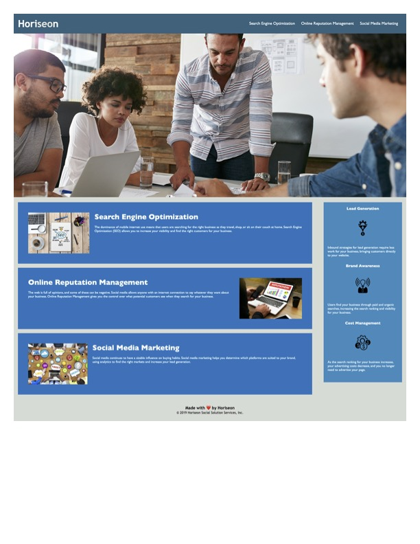

# <Challenge 1>

## Description

This code updates the accessibilty standards of the webpage. It adds semantic elements as well as alt tags to the various images in order to make the flow of the webapge more understandable. Each element falls in sequential order and the CSS code has also been cleaned up and organized.

## Usage

## License

MIT
---

